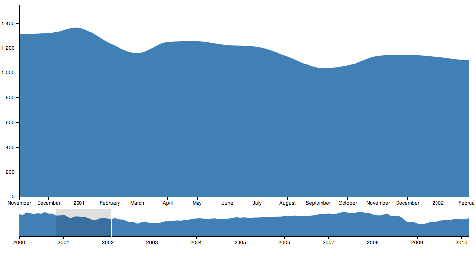

# NOTICE 12-27-14

So I renamed this project `choir`. `inode` was already taken in npm. [Choir](https://github.com/dalejung/choir)

Interactive Node.js
-------------------

Modified REPL to behave like `ipython`. 

## Run Magic

```
%run path/to/file
```

This is modeled after the `%run` magic of `ipython`. 

It differs from `require` in the following ways:

* The file will execute in shell and it's namespace will be merged into `global`.
* The file will act as if it's located in the `inode` startup directory. `require` will be anchored there.
* The executions will not cache. Each call will re-execute the script.

**`.html` executing**

In addition to running `.js` files, you may also run a `.html` file. This will do following:

1. Create an mepty `jsdom` `window`. This is slightly modified with a `XMLHttpRequest` that will grab the file locally. 
2. Set the `document.innerHTML` to the contents of the `.html` file. 
3. Wait for the `window` to gain new varialbes. This part is done via a simple function that checks via `setTimeout`. 
4. Take the changed variables from `window` and bring them to the `REPL` `global` context. 
5. Set the internal webserver to output the rendered html minus the script tags (as those are running in the internal `jsdom` and are not required for a client browser).

The above steps have the effect of running an html page as if it were the browser, and allowing you to modify the dom from the `inode` shell. Advantages over just editing a script and refreshing a browser page:

* Allows you to stay in CLI with the `inode` shell. For me it's vim/tmux which is infintely more effective than using the browser javacript console. 
* Because we bring the html global into the shell, we can modify the dom and see the rendered output by refreshing the page. 
* We can also `%run` additional scripts that modify the dom. As long as we don't run another `html` file, our `DOM` will be persistent. 

## Workflow

In general there are 3 different workflows. 

1. The first is purely `node.js`. If you're not touching anything that outputs to the browser, then you obviously have no need for the `html` execution. Note that using something like `d3` in `node.js` implicitly creates its own `jsdom` objects in some way doesn't differ from the html execution approach. Though, it's still supported and you can output the standalone `d3` html via the `_http_callback`.
2. Executing an html file and playing with it via `inode`. This appears to be the most useful. Like I said above, some `node.js` modules are implicitly creating the DOM. Note, that all of the javascript logic runs **in** `inode`. If you were to try to [Rounded Rectangle](http://bl.ocks.org/mbostock/1123639) you would get the current frame on each refresh and **not** the animation tiself. 
3. Straight html. The internal webserver will also serve up `.html` files. Because it is rooted at the inode startup directory, it should replicate the `inode` XHR logic. Meaning that if you have a request for `data.json` that lives in the same directory, the internal html execution will grab that file locally, while the straight html will make a webrequest that grabs the same file. So, that means that an `.html` file should output the **same** DOM when accessed both ways. 

**Seprating DOM environments**

You will notice that there is a strict separation between whether scripts execute in the browser or internally. This means that you will never animation/callbacks via *html execution* because we strip the javascript. It is possible to keep `inode` from stripping a `script` by adding an `inode-keep="true"` attribute. However, this would require you to completely separate out your event binding/selection from your data manipulations. 

So far I've found that to be too laborious.

## Internal Web Server

When you start up `inode`, the kernel will also startup a webserver hosted at port `8889`. This will output the `DOM` of the last run `html` file. You may customize the output by creating a `_http_callback' function that lives in the shell namespace.

The server will also act like a normal webserver for pathed urls. The webroot will be the `inode` startup directory. So if you started up inode in its `demo` directory, `http://localhost:8889/brush/brush.html' would show you the Brush demo. 

------

# Brush Demo

```javascript
%run ./brush.html

var data = focus.select('path').datum()
var l = [data[10].date, data[25].date]
brush.extent(l)
brushed()
// redraw the extent rect
var ex = x2(l[0]);
var width = x2(l[1]) - ex;
var extent = context.select('g.x.brush rect.extent');
extent.attr('x', ex);
extent.attr('width', width);
```
This run the vanilla [brush demo](http://bl.ocks.org/mbostock/1667367). It then modifies the brush extent and calls the handler that modifies the top chart. It also redraws the rect which is not handled by `brushed()`. 



## Tips

Place the following in your `.vimrc`
```
autocmd FileType javascript map <buffer> <S-r> :w<CR>:!tmux send-keys -t inode "\%run %:p" enter<CR><CR>
```

Pressing `Shift + R` while editing a `.js` file in `vim` will execute the file in a tmux session named `inode`.

## Future Plans

* `ls`, `pwd`, `cd`, etc filesystem magics
